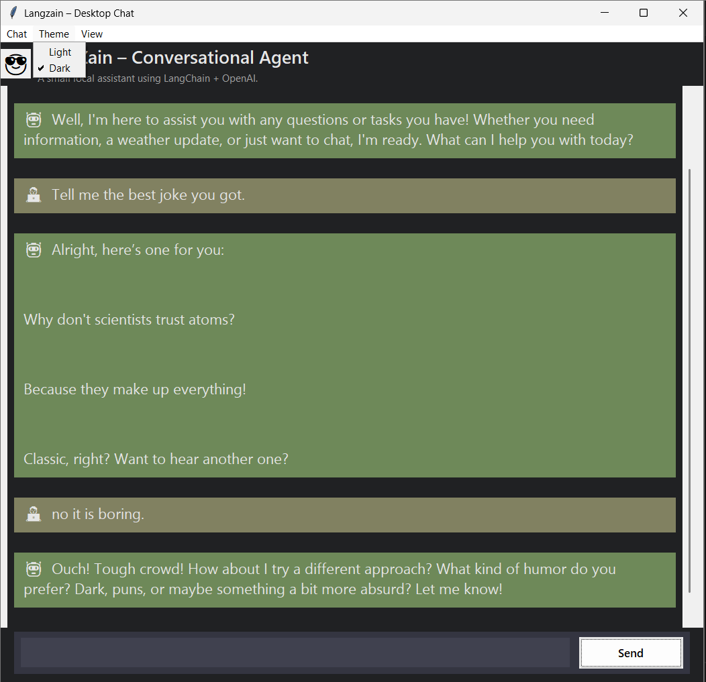
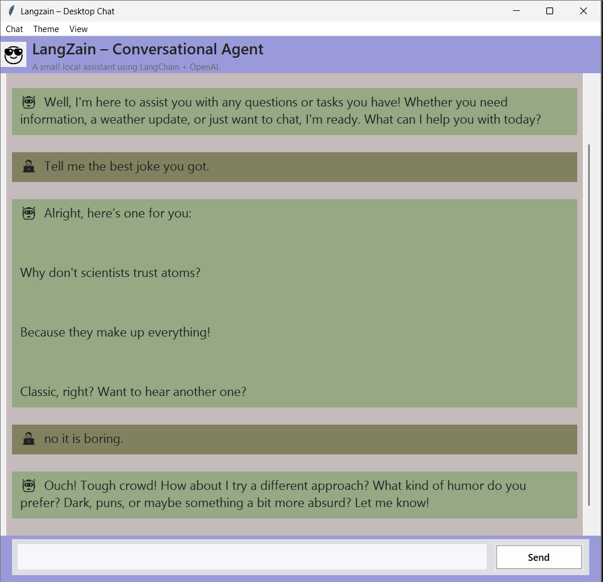
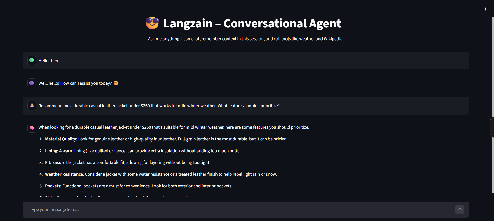

# Langzain – OpenAI + LangChain Conversational Agent

Langzain is a small Python project where I teach a language model to behave like a tiny agent.  
It can chat, remember what you said earlier in the session, and call a couple of tools (weather + Wikipedia) when it needs extra info.

## Features

- 💻 **CLI chat** (`app.py`) – talk to the agent from the terminal.
- 🌐 **Streamlit web UI** (`ui_app.py`) – lightweight “ChatGPT-style” page in the browser.
- 🪟 **Desktop GUI** (`LangzainGUI.py`) – standalone Tkinter app with dark/light theme and thinking indicator.

> 🔐 You must bring your own API key (OpenAI or an OpenAI-compatible provider such as OpenRouter).
> Add it to a `.env` file – the repo never includes any keys.

---

## Setup

git clone https://github.com/mzzoony/Langzain.git
cd Langzain

python -m venv .venv

# Windows:
.venv\Scripts\activate

pip install -r requirements.txt

## Install & Run

### Option 1 – Clone the repo (recommended)

This is the best way if you want both the terminal chat and the Streamlit UI.

git clone https://github.com/mzzoony/Langzain.git
cd Langzain

# Create and activate a virtual environment (Windows)
python -m venv .venv
.\.venv\Scripts\activate

# Install dependencies
pip install -r requirements.txt

# Install the langzain package in editable mode
pip install -e .

-Before you run anything, create a .env file in the project root and add your key:
  OPENAI_API_KEY=sk-...

#### How to run – three modes

Add a **Usage** section (or update the existing one):

## Usage

### 1. Terminal chat (CLI)

.\.venv\Scripts\activate
python -m langzain.app

### 2. Browser chat (Streamlit, optional)
.\.venv\Scripts\activate
streamlit run langzain/ui_app.py

### 3. Desktop GUI (Tkinter)
.\.venv\Scripts\activate
python run_langzain_gui.py

## To use it like a normal Windows app, build a standalone exe with:
pyinstaller --onefile --noconsole ^
  --name LangzainGUI ^
  --icon=assets\langzain.ico ^
  run_langzain_gui.py

## Screenshots:
   # Desktop GUI – Dark theme:

   # Desktop GUI – Light theme:

